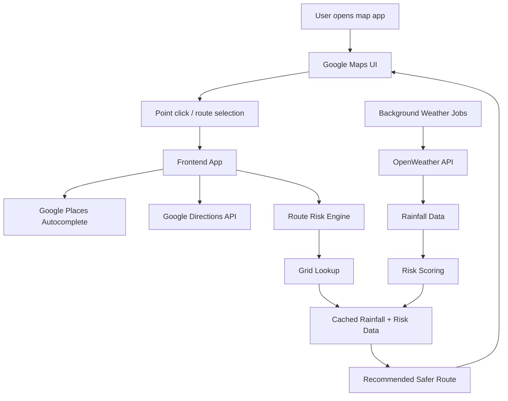
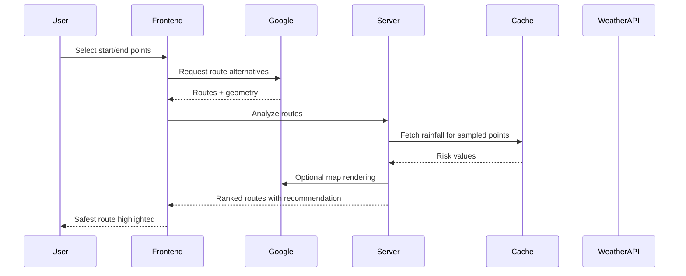

# Flood-Risk Route Advisor

## Project Overview

- A smart mapping and weather-based decision support app for Kota, Rajasthan
- Helps users identify flood risk at a clicked point or compare safer routes between two locations
- Integrates Google Maps, weather intelligence, and route analysis into one decision platform

---

## 1. Problem Statement

- Heavy rainfall can make roads unsafe or impassable
- Users need a practical way to understand risk before traveling
- Traditional map apps focus only on navigation, not flood risk
- Goal: recommend the safest available route using rainfall and map-based route analysis

---

## 2. Core Idea

- Instead of querying weather APIs live for every request, the app precomputes data on a grid
- A background job refreshes rainfall and risk scores at scheduled intervals
- User requests only read from cached grid-based data
- This keeps API usage predictable and affordable

---

## 3. System Architecture

---

## 4. Why this Architecture?

- OpenWeather quota is limited and expensive
- Google Maps quota is more flexible
- Design principle:
  - Use Google Maps heavily for routing and geospatial work
  - Keep OpenWeather calls fixed and predictable
- This reduces cost and makes the system scalable

---

## 5. How Risk Is Calculated

- Risk starts from rainfall intensity
- Thresholds:
  - Below 10 mm/hr → Low
  - 10–30 mm/hr → Medium
  - Above 30 mm/hr → High
- For routes:
  - Get multiple route alternatives from Google Directions
  - Sample points along each route
  - Look up rainfall risk for each sampled point
  - Route risk = worst sampled risk
- This follows a safer principle:
  - “A single risky stretch makes the whole route risky”

---

## 6. Data Flow for a Route

---

## 7. What Has Been Built

- Click-based map analysis
- Reverse geocoding for point names
- Grid-based rainfall cache
- Background refresh jobs
- Route comparison and ranking
- Colored route overlays
- Two-point route recommendation UI
- Manual cache refresh for development

---

## 8. Verified vs. Open Issues

### Verified
- Type-checking and linting pass
- Route pipeline returns real route names, distances, and durations
- Point-click behavior works with graceful fallback when data is empty

### Still Open
- Real rainfall data is not flowing yet because the required OpenWeather subscription is not active
- Elevation-based risk refinement is implemented but currently disabled
- Server-side Google key may need separate configuration depending on access rules

---

## 9. Key Technical Decisions

- Grid-based caching over live requests
- Worst-case risk selection for route safety
- Configurable thresholds and refresh intervals
- Feature-flagged elevation logic
- Optimized for cost efficiency and scalability

---

## 10. Future Roadmap

- Activate live weather subscription
- Enable elevation-based risk adjustment
- Improve risk calibration using real-world data
- Expand area coverage and resolution
- Improve route recommendation with more robust scoring

---

## 11. Final Summary

- This project is a practical flood-risk route advisor built around map intelligence and weather data
- It prioritizes scalability, low API cost, and actionable route decisions
- The architecture is designed to support future refinement without redesigning the whole system

---

## Speaker Notes

This project was built to solve a practical problem: helping travelers identify flood-prone roads and choose safer routes during heavy rainfall. The architecture is intentionally optimized around API cost and scalability, using Google Maps for geospatial functions and a precomputed weather grid to reduce expensive OpenWeather calls. The system is designed to be extendable, with room for better risk calibration and elevation-based refinement in future iterations.
